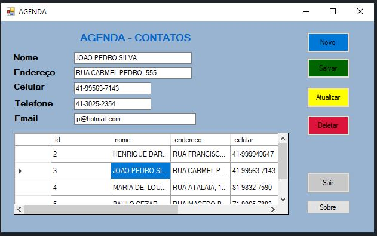

# -Agenda de contatos

## 📕 Índice

- [Sobre](#-sobre)
- [Tecnologias Utilizadas](#-tecnologias-utilizadas)

## 🗒 Sobre

Agenda Simples de contato, com um CRUD para o SQL server 2017

## 🚀 Tecnologias utilizadas

- .NET
- C#
- SQL Server 2017
